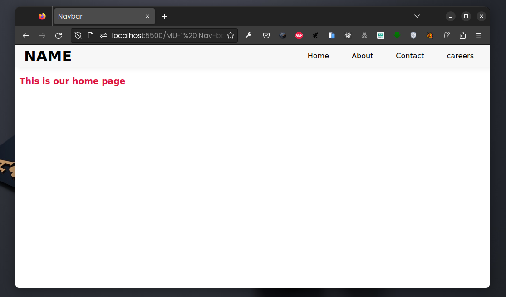

# This repo contains source code for our local communitiy's Web-track
## Meet-Up 1 Nav-Bar
**Friday Feb 3rd 2023** \
During this session we introduced some basic HTML and CSS concepts to out newer members.  
We built a simple **nav-bar** as a of demonstrating the basic use of HTML and CSS.  

### The source code is [here](./1-NavBar/)

&nbsp;  
&nbsp;  

    <h3>Our leads</h3>
    
Abel Misiocha <a href="https://github.com/Codedwells">GitHub</a>

    
Cliff Omollo <a href="https://github.com/OsegoTech">GitHub</a>

